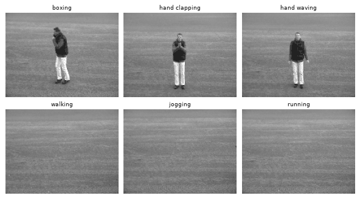

# Deep Learning with PyTorch

A collection of deep learning notebooks implemented in **PyTorch**, from the basics (MLPs, CNNs) to Transformers, generative models, graph neural networks and multimodal models, plus an in-depth **video action recognition** project.

Most models are built from scratch (attention, Vision Transformer, VAE, GCN, mini-GPT, mini-CLIP), and each notebook ends with an analysis of its results.

<p align="center">
  
</p>

---

## Featured project: Human Action Recognition in Videos

**[`projects/video-action-recognition`](projects/video-action-recognition/)**: a benchmark of **five spatio-temporal architectures** on the KTH dataset (6 actions, 25 subjects, 599 videos), done as a three-person team project.

| Frame representation | Temporal model | Models compared |
|---|---|---|
| Frozen **MobileNetV2** features (1280-d per frame) | Mean pooling · **LSTM** · **Transformer** ([CLS] token, learned positional embeddings) | 3 |
| **Skeleton graph** from Keypoint R-CNN (17 COCO joints) + hand-written **GCN** | **LSTM** · **Transformer** | 2 |

What the study covers:
- strict **subject-wise splits** (no person shared across train / validation / test);
- ablation over sequence length, **multi-seed runs** (10–11 seeds) and **bootstrap confidence intervals over test subjects**;
- interpretability: real attention maps, **frame-shuffling and time-reversal tests**, error galleries;
- dense sampling over annotated action segments, an explicit motion signal, and **subject-wise 5-fold cross-validation**.

**Key findings**
- On KTH, most of the accuracy comes from **per-frame appearance**, not from frame order: the Transformer loses **0 points** when test frames are shuffled, and a per-frame MLP + mean pooling matches it. Only the LSTM actually uses temporal order.
- **How the video is sampled matters more than the temporal head.** Sampling consecutive frames inside annotated action segments (12.5 fps) instead of spreading 32 frames over the whole video raises every head by **+6.5 to +11.8 points**.
- 5-fold subject cross-validation: **87.5 ± 4.1 %** (sinusoidal Transformer) and **85.0 ± 5.0 %** (per-frame MLP + mean). The ± 4–5 point spread across folds shows that a single split is not enough to rank models.

---

## Notebooks

Click the badge to open a notebook directly in Google Colab.

### 1. Fundamentals
| Notebook | Topics | Data |
|---|---|---|
| [MLP on MNIST](notebooks/01-fundamentals/01_mlp_mnist.ipynb) [](https://colab.research.google.com/github/MissawB/deep-learning-pytorch/blob/main/notebooks/01-fundamentals/01_mlp_mnist.ipynb) | Multilayer perceptron, training loop, evaluation, improvements | MNIST |

### 2. Computer Vision
| Notebook | Topics | Data |
|---|---|---|
| [Binary CNN classifier](notebooks/02-computer-vision/01_cnn_binary_classification.ipynb) [](https://colab.research.google.com/github/MissawB/deep-learning-pytorch/blob/main/notebooks/02-computer-vision/01_cnn_binary_classification.ipynb) | CNN from scratch, validation monitoring, error analysis | Cats vs Dogs |
| [Multi-class CNN & transfer learning](notebooks/02-computer-vision/02_cnn_multiclass_transfer_learning.ipynb) [](https://colab.research.google.com/github/MissawB/deep-learning-pytorch/blob/main/notebooks/02-computer-vision/02_cnn_multiclass_transfer_learning.ipynb) | Baseline CNN, data augmentation, transfer learning, fine-tuning | 8-class clothing images |
| [Vision Transformer from scratch](notebooks/02-computer-vision/03_vision_transformer_from_scratch.ipynb) [](https://colab.research.google.com/github/MissawB/deep-learning-pytorch/blob/main/notebooks/02-computer-vision/03_vision_transformer_from_scratch.ipynb) | Patch embedding, multi-head self-attention, ViT vs CNN | 8-class clothing images |
| [Pretrained ViT vs pretrained CNN](notebooks/02-computer-vision/04_pretrained_vit_vs_cnn.ipynb) [](https://colab.research.google.com/github/MissawB/deep-learning-pytorch/blob/main/notebooks/02-computer-vision/04_pretrained_vit_vs_cnn.ipynb) | Fine-tuning `vit_b_32` vs a pretrained CNN (≈ 96 % for both) | 8-class clothing images |

### 3. Sequence Models (time series, text, skeletons)
| Notebook | Topics | Data |
|---|---|---|
| [Time-series forecasting with LSTM](notebooks/03-sequence-models/01_time_series_forecasting_lstm.ipynb) [](https://colab.research.google.com/github/MissawB/deep-learning-pytorch/blob/main/notebooks/03-sequence-models/01_time_series_forecasting_lstm.ipynb) | Sliding windows, LSTM forecasting | Tesla stock prices ([`data/`](data/)), airline passengers |
| [LSTM vs Transformer for stock prices](notebooks/03-sequence-models/02_lstm_vs_transformer_stock_prices.ipynb) [](https://colab.research.google.com/github/MissawB/deep-learning-pytorch/blob/main/notebooks/03-sequence-models/02_lstm_vs_transformer_stock_prices.ipynb) | Hand-written Transformer encoder vs LSTM, multi-step forecasting | Yahoo Finance (`yfinance`) |
| [Text generation: N-gram vs causal LSTM](notebooks/03-sequence-models/03_text_generation_ngram_vs_causal_lstm.ipynb) [](https://colab.research.google.com/github/MissawB/deep-learning-pytorch/blob/main/notebooks/03-sequence-models/03_text_generation_ngram_vs_causal_lstm.ipynb) | Two language-modeling schemes, greedy vs top-k sampling | Irish song lyrics |
| [Mini-GPT text generation](notebooks/03-sequence-models/04_mini_gpt_text_generation.ipynb) [](https://colab.research.google.com/github/MissawB/deep-learning-pytorch/blob/main/notebooks/03-sequence-models/04_mini_gpt_text_generation.ipynb) | GPT-style decoder, causal masking, autoregressive generation | IMDB movie reviews |
| [Skeleton action recognition with LSTM](notebooks/03-sequence-models/05_skeleton_action_recognition_lstm.ipynb) [](https://colab.research.google.com/github/MissawB/deep-learning-pytorch/blob/main/notebooks/03-sequence-models/05_skeleton_action_recognition_lstm.ipynb) | Stacked LSTM, leakage-free scaling, gradient clipping | 2D skeleton keypoints |

### 4. Generative Models
| Notebook | Topics | Data |
|---|---|---|
| [Autoencoders](notebooks/04-generative-models/01_autoencoders.ipynb) [](https://colab.research.google.com/github/MissawB/deep-learning-pytorch/blob/main/notebooks/04-generative-models/01_autoencoders.ipynb) | Dense, denoising and convolutional autoencoders, latent space | MNIST |
| [Variational autoencoder](notebooks/04-generative-models/02_variational_autoencoder.ipynb) [](https://colab.research.google.com/github/MissawB/deep-learning-pytorch/blob/main/notebooks/04-generative-models/02_variational_autoencoder.ipynb) | Reparameterization trick, ELBO / KL divergence, latent-space sampling | MNIST |
| [Diffusion models for text-to-image](notebooks/04-generative-models/03_diffusion_text_to_image.ipynb) [](https://colab.research.google.com/github/MissawB/deep-learning-pytorch/blob/main/notebooks/04-generative-models/03_diffusion_text_to_image.ipynb) | Forward/reverse process, text-conditioned U-Net from scratch, InstructPix2Pix image editing with `diffusers` | Flickr8k |

### 5. Graph Neural Networks
| Notebook | Topics | Data |
|---|---|---|
| [GCN for sign language recognition](notebooks/05-graph-neural-networks/01_gcn_sign_language_recognition.ipynb) [](https://colab.research.google.com/github/MissawB/deep-learning-pytorch/blob/main/notebooks/05-graph-neural-networks/01_gcn_sign_language_recognition.ipynb) | Hand landmarks (MediaPipe) as graphs, GCN classifier | ASL alphabet (Kaggle) |
| [GCN for protein graph classification](notebooks/05-graph-neural-networks/02_gcn_enzymes_graph_classification.ipynb) [](https://colab.research.google.com/github/MissawB/deep-learning-pytorch/blob/main/notebooks/05-graph-neural-networks/02_gcn_enzymes_graph_classification.ipynb) | Graph-level classification with PyTorch Geometric | ENZYMES (TUDataset) |

### 6. Multimodal Learning
| Notebook | Topics | Data |
|---|---|---|
| [CLIP from scratch & zero-shot classification](notebooks/06-multimodal/01_clip_contrastive_learning_zero_shot.ipynb) [](https://colab.research.google.com/github/MissawB/deep-learning-pytorch/blob/main/notebooks/06-multimodal/01_clip_contrastive_learning_zero_shot.ipynb) | Contrastive loss, mini-CLIP (87 % zero-shot) vs OpenAI CLIP | FashionMNIST |
| [Fine-tuning CLIP](notebooks/06-multimodal/02_clip_fine_tuning.ipynb) [](https://colab.research.google.com/github/MissawB/deep-learning-pytorch/blob/main/notebooks/06-multimodal/02_clip_fine_tuning.ipynb) | Zero-shot vs linear probing vs partial fine-tuning | FashionMNIST |

---

## Repository structure

```
deep-learning-pytorch/
├── notebooks/
│   ├── 01-fundamentals/
│   ├── 02-computer-vision/
│   ├── 03-sequence-models/
│   ├── 04-generative-models/
│   ├── 05-graph-neural-networks/
│   └── 06-multimodal/
├── projects/
│   └── video-action-recognition/   # featured project (notebook, README, GIFs)
├── data/                           # small datasets shipped with the repo
└── requirements.txt
```

## Getting started

**Google Colab (recommended).** Every notebook was run on Google Colab and opens directly with the badges above. Public datasets (MNIST, FashionMNIST, ENZYMES, KTH, Flickr8k…) are downloaded by the notebooks themselves.

**Locally.**
```bash
git clone https://github.com/MissawB/deep-learning-pytorch.git
cd deep-learning-pytorch
python -m venv .venv && source .venv/bin/activate   # Windows: .venv\Scripts\activate
pip install -r requirements.txt
jupyter lab
```
Install the PyTorch build matching your CUDA version from [pytorch.org](https://pytorch.org/get-started/locally/) for GPU support.

**Datasets.** A few notebooks (cats vs dogs, 8-class clothing, 2D skeletons) read a zip archive from Google Drive; adjust the path at the top of the data-loading cell to point to your own copy.

## Tech stack

PyTorch · torchvision · PyTorch Geometric · Hugging Face `transformers` / `diffusers` · scikit-learn · OpenCV · MediaPipe · NumPy · pandas · Matplotlib / seaborn

## Acknowledgments

The notebooks in `notebooks/` started from guided lab material from my Master's deep learning courses; the implementations, experiments and written analyses are my own. Lab templates authored by Omar Ikne (IMT Nord Europe) are credited in their headers. The video action recognition project was carried out with Lucas Landemaine and Liam Touier.
