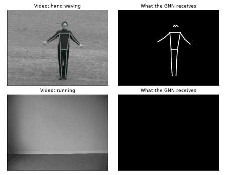

# Human Action Recognition in Videos: CNN vs GNN, LSTM vs Transformer

Team project by **Wassim Bahmani**, **Lucas Landemaine** and **Liam Touier**.

Which matters more for recognizing human actions in video: how each frame is represented, or how time is modeled? This project benchmarks five spatio-temporal architectures on the [KTH dataset](https://www.csc.kth.se/cvap/actions/) and then checks, with controlled experiments, whether the "temporal" models really use time.

  

## Models

| # | Model | Frame representation | Temporal modeling |
|---|---|---|---|
| 1 | Temporal mean | Frozen MobileNetV2 (1280-d) | Per-frame projection + average (order-agnostic) |
| 2 | CNN + LSTM | Frozen MobileNetV2 | 2-layer LSTM |
| 3 | CNN + Transformer | Frozen MobileNetV2 | Transformer encoder, [CLS] token, learned positional embeddings |
| 4 | GNN + LSTM | 17-joint skeleton (Keypoint R-CNN) + 2-layer GCN | LSTM |
| 5 | GNN + Transformer | 17-joint skeleton + 2-layer GCN | Transformer encoder |

All models share the same subject-wise split, the same training engine (AdamW, cosine schedule, gradient clipping, best-validation checkpoint) and the same hyperparameters, so the comparison is fair.

## Experiments

1. **Data exploration**: motion energy, scenario variations, and the effect of temporal sampling (aliasing when 16 frames are spread over an ~18 s video).
2. **Main benchmark** of the 5 models, with latency measurements (the pose estimator dominates the cost: ≈ 480 ms vs ≈ 17 ms for MobileNetV2 on 16 frames).
3. **Sequence length ablation** ($T \in \{4, 8, 16, 32\}$).
4. **Interpretability**: real attention maps of the [CLS] token, prediction galleries, frame-shuffling and time-reversal tests.
5. **Statistical robustness**: 10 seeds per configuration and bootstrap confidence intervals over test subjects.
6. **Second protocol** on the official KTH split with alternative heads (11 seeds) and control experiments (positional embeddings zeroed, training on shuffled frames, per-frame MLP + mean).
7. **Dense sampling** inside the annotated action segments (`00sequences.txt`), an **explicit motion signal** ($[x_t, x_t - x_{t-1}]$), and **subject-wise 5-fold cross-validation**.

## Results

Main benchmark (test set of 11 unseen subjects, $T = 16$, single seed):

| Model | Test accuracy | Macro F1 |
|---|---|---|
| Temporal mean | 78.8 % | 0.79 |
| CNN + LSTM | 65.2 % | 0.64 |
| **CNN + Transformer** | **80.7 %** | **0.81** |
| GNN + LSTM | 40.5 % | 0.27 |
| GNN + Transformer | 53.4 % | 0.50 |

Subject-wise 5-fold cross-validation (dense sampling at 12.5 fps, $T = 32$):

| Model | Accuracy (mean ± std over folds) |
|---|---|
| Per-frame MLP + mean | 85.0 ± 5.0 % |
| Transformer (sinusoidal positions) | 87.5 ± 4.1 % |

## Key findings

- **Appearance, not order.** Shuffling the test frames costs the Transformer **0 points** (over 10 seeds), while the LSTM drops by 7 to 14 points. A per-frame MLP followed by mean pooling, with no notion of order, matches the Transformer. The Transformer's edge comes from selecting informative frames, not from following motion.
- **Sampling is the bottleneck.** Spreading frames over the whole video gives about one frame per second, often empty for locomotion actions. Sampling consecutive frames inside annotated action segments improves every head by **+6.5 to +11.8 points**.
- **CNN features beat skeletons on KTH** (by about 25 points): people are small, low-resolution and often out of frame, so pose estimation is unreliable, and mean pooling over joints erases joint identity.
- **Single numbers are fragile.** With ~190 training videos, one seed can move an LSTM result by several points, and test folds differ by ± 4–5 points. Conclusions are therefore backed by multi-seed runs, bootstrap intervals and cross-validation.

## Running the notebook

The notebook downloads KTH automatically (≈ 1 GB) and caches the extracted features. A GPU is strongly recommended (the reference run used a Tesla T4 on Google Colab); without network access, it falls back to a small synthetic stick-figure dataset so the code can still be tested end to end.

> Note: the saved outputs come from the original reference run, and the analysis quotes those exact numbers. Re-running gives close but not identical values, because GPU computations differ slightly across hardware.
